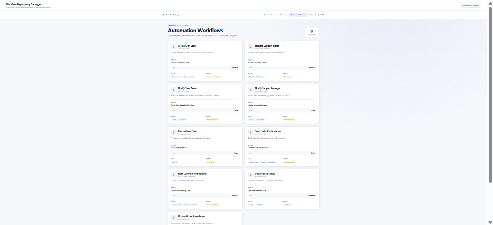
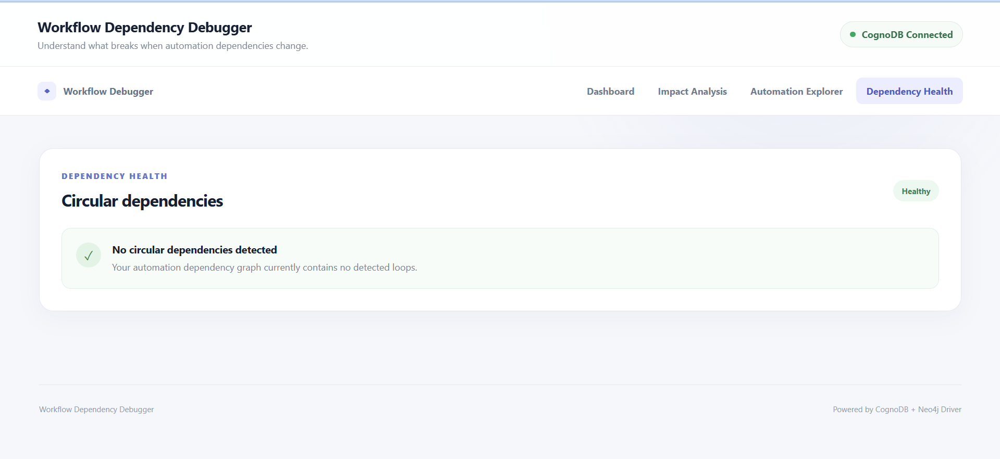

# Workflow Dependency Debugger

A graph-based application for understanding automation dependencies, identifying downstream workflow impact, and detecting circular dependencies.

Built as part of the **Wexa AI — CognoDB Graph Database Take-Home Assignment**.

---

## Overview

Modern businesses often have multiple automations that depend on shared data fields.

For example, one automation may update a `Lead Status`, while another automation reads that same field and sends a notification.

When one automation or shared data field changes, it can affect other workflows.

The **Workflow Dependency Debugger** makes these relationships visible using a graph database.

The application allows users to:

* Explore automation workflows
* See the tools and actions used by each automation
* See which data fields each automation reads and writes
* Analyze the downstream impact of changing a shared data field
* Visualize multi-hop automation dependencies
* Detect circular dependencies in the automation ecosystem

---

# Why a Graph Database?

Automation dependencies are naturally represented as relationships between entities.

A relational database could store automations, actions, tools, and data fields in separate tables. However, finding indirect dependencies across multiple relationships would require several joins and recursive queries.

A graph database represents these connections directly.

For example:

```text
Create CRM Lead
       |
       | WRITES
       v
   Lead Status
       ^
       | READS
       |
Notify Sales Team
```

The graph makes it easy to answer questions such as:

> If an automation changes a particular data field, which other automations may be affected?

It also makes multi-hop traversal and circular dependency detection natural graph operations.

The application uses **CognoDB** as the graph database and communicates with it using the official **Neo4j Python driver** over the Bolt protocol.

---

# Graph Data Model

The application uses the following graph model.

## Nodes

### Automation

Represents an automation workflow.

Properties:

* `id`
* `name`
* `description`

### Action

Represents an action performed by an automation.

Properties:

* `id`
* `name`

### Tool

Represents an external tool used by an action.

Properties:

* `id`
* `name`
* `category`

Examples:

* Salesforce
* Slack
* Gmail
* Google Sheets
* HubSpot
* Stripe
* Zendesk

### DataField

Represents a shared data field used by automations.

Properties:

* `id`
* `name`

Examples:

* Customer Email
* Lead Status
* Order Status
* Ticket Status

### Trigger

Represents an event or data change that starts an automation.

Properties:

* `id`
* `name`
* `type`

---

## Relationships

```text
Trigger ──STARTS──────> Automation

Automation ──HAS_ACTION──────> Action

Action ──USES_TOOL──────> Tool

Action ──READS──────> DataField

Action ──WRITES──────> DataField

Automation ──DEPENDS_ON──────> Automation
```

### Graph Model Diagram

```text
                         ┌─────────────────┐
                         │     Trigger     │
                         │                 │
                         │ id              │
                         │ name            │
                         │ type            │
                         └────────┬────────┘
                                  │
                               STARTS
                                  │
                                  ▼
                         ┌─────────────────┐
                         │   Automation    │
                         │                 │
                         │ id              │
                         │ name            │
                         │ description     │
                         └────────┬────────┘
                                  │
                              HAS_ACTION
                                  │
                                  ▼
                         ┌─────────────────┐
                         │     Action      │
                         │                 │
                         │ id              │
                         │ name            │
                         └───────┬─────────┘
                                 │
                   ┌─────────────┼──────────────┐
                   │             │              │
                USES_TOOL      READS          WRITES
                   │             │              │
                   ▼             ▼              ▼
             ┌──────────┐  ┌────────────┐  ┌────────────┐
             │   Tool   │  │ DataField  │  │ DataField  │
             │          │  │            │  │            │
             │ id       │  │ id         │  │ id         │
             │ name     │  │ name       │  │ name       │
             │ category │  └────────────┘  └────────────┘
             └──────────┘


          Automation ──DEPENDS_ON──> Automation
```

This model allows the application to traverse relationships between automations, actions, tools, and shared data fields.

---

# Sample Dependency

One example in the seeded dataset is the Lead Status dependency.

```text
┌──────────────────────┐
│   Create CRM Lead    │
└──────────┬───────────┘
           │
           │ WRITES
           ▼
┌──────────────────────┐
│     Lead Status      │
└──────────┬───────────┘
           │
           │ READS
           ▼
┌──────────────────────┐
│  Notify Sales Team   │
└──────────────────────┘
```

This represents a dependency where a change to `Lead Status` can affect the downstream sales notification automation.

---

# Features

## 1. Dashboard

The dashboard provides an overview of the automation ecosystem.

It displays:

* Number of automations
* Number of shared data fields
* Number of dependency cycles

It also provides navigation to the main application capabilities.

---

## 2. Impact Analysis

Users can select a shared data field and analyze its automation dependencies.

The application identifies:

* Automations that write to the selected field
* Downstream automations that depend on the field
* Dependency depth

Example:

```text
Create CRM Lead
       │
       │ WRITES
       ▼
  Lead Status
       │
       │ READS
       ▼
Notify Sales Team
```

The graph visualization helps users understand the impact before changing a shared field.

---

## 3. Automation Explorer

The Automation Explorer displays all available automation workflows.

For each automation, users can see:

* Automation name
* Automation ID
* Description
* Action
* Tool
* Fields read
* Fields written

The current seed dataset contains **9 automations**.

---

## 4. Dependency Health

The Dependency Health section checks for circular dependencies.

For example:

```text
Automation A
     ↓
Automation B
     ↓
Automation C
     ↓
Automation A
```

This represents a circular dependency.

The application reports detected cycles and displays a healthy state when no cycles are found.

The current seed dataset contains:

**0 detected circular dependencies.**

---

# Seed Dataset

The application contains realistic sample automation data.

## Automations

The seed dataset contains 9 automations:

1. Create CRM Lead
2. Update Lead Status
3. Notify Sales Team
4. Start Customer Onboarding
5. Process New Order
6. Update Order Spreadsheet
7. Send Order Confirmation
8. Escalate Support Ticket
9. Notify Support Manager

## Data Fields

The application contains 13 shared data fields:

1. Customer ID
2. Customer Name
3. Customer Email
4. Lead ID
5. Lead Status
6. Deal ID
7. Deal Status
8. Order ID
9. Order Status
10. Ticket ID
11. Ticket Status
12. Notification Status
13. Onboarding Status

## Tools

The seed data contains:

* Slack
* Salesforce
* Gmail
* Google Sheets
* HubSpot
* Stripe
* Zendesk

---

# Main Graph Queries

The application uses Cypher queries through the Neo4j Python driver.

## Automation Graph Query

File:

```text
backend/queries/automation_graph.cypher
```

This query retrieves:

* Automations
* Actions
* Tools
* Data fields read
* Data fields written

It traverses relationships such as:

```text
Automation → Action → Tool
Automation → Action → DataField
```

The query uses `OPTIONAL MATCH` so that an automation can still be returned even if an optional relationship is not present.

---

## Impact Analysis Query

File:

```text
backend/queries/impact_analysis.cypher
```

The query starts with a selected `DataField`.

It finds automations whose actions write to that field.

It then follows graph relationships through shared data fields to discover affected downstream automations.

The multi-hop traversal allows the application to identify dependencies beyond a single direct relationship.

For example:

```text
Automation
    ↓
DataField
    ↓
Automation
```

This demonstrates the type of traversal that makes graph databases useful for dependency analysis.

---

## Circular Dependency Query

File:

```text
backend/queries/circular_dependencies.cypher
```

This query searches for paths where an automation eventually connects back to itself.

Conceptually:

```text
Automation A
     ↓
Automation B
     ↓
Automation C
     ↓
Automation A
```

The query uses a variable-length `DEPENDS_ON` traversal to identify possible cycles.

---

# Technology Stack

## Frontend

* React
* Vite
* Axios
* React Flow

## Backend

* Python
* FastAPI
* Uvicorn
* Neo4j Python Driver

## Database

* CognoDB
* OpenCypher
* Bolt protocol

## Graph Visualization

* React Flow

---

# Project Structure

```text
workflow-dependency-debugger/
│
├── frontend/
│   ├── src/
│   │   ├── components/
│   │   │   ├── Navbar.jsx
│   │   │   ├── StatCard.jsx
│   │   │   ├── GraphView.jsx
│   │   │   ├── AutomationCard.jsx
│   │   │   ├── LoadingState.jsx
│   │   │   ├── EmptyState.jsx
│   │   │   └── ErrorState.jsx
│   │   │
│   │   ├── pages/
│   │   │   ├── Dashboard.jsx
│   │   │   ├── AutomationExplorer.jsx
│   │   │   ├── ImpactAnalyzer.jsx
│   │   │   └── DependencyHealth.jsx
│   │   │
│   │   ├── services/
│   │   │   └── api.js
│   │   │
│   │   ├── App.jsx
│   │   ├── main.jsx
│   │   └── index.css
│   │
│   ├── package.json
│   ├── vite.config.js
│   └── index.html
│
├── backend/
│   ├── routes/
│   │   ├── automations.py
│   │   ├── impact.py
│   │   └── dependencies.py
|   |   |__ fields.py
│   │
│   ├── queries/
│   │   ├── automation_graph.cypher
│   │   ├── impact_analysis.cypher
│   │   └── circular_dependencies.cypher
│   │
│   ├── database.py
│   ├── main.py
│   ├── seed.py
│   └── requirements.txt
│
├── screenshots/
│   ├── dashboard.png
│   ├── automation-explorer.png
│   ├── impact-analysis.png
│   └── dependency-health.png
│
├── .env.example
├── .gitignore
└── README.md
```

---

# Environment Configuration

Connection credentials must never be committed to the repository.

Create a `.env` file in the backend project as required by the application.

Example:

```env
COGNODB_URI=bolt+s://your-instance-id.databases.cognodb.cloud
COGNODB_USERNAME=cognodb
COGNODB_PASSWORD=your-password
```

The actual password should never be placed in the GitHub repository.

The `.env` file should be included in `.gitignore`.

---

# CognoDB Setup

1. Create a CognoDB Cloud account.
2. Create a free CognoDB instance.
3. Copy the generated Bolt connection URI.
4. Save the generated database password.
5. Configure the environment variables.
6. Install the Python dependencies.
7. Run the seed script.
8. Start the FastAPI backend.
9. Start the React frontend.

---

# Running the Backend

Open a terminal in:

```text
workflow-dependency-debugger/backend
```

Activate the virtual environment.

Then install the dependencies:

```bash
pip install -r requirements.txt
```

Run the seed script:

```bash
python seed.py
```

Start the FastAPI server:

```bash
uvicorn main:app --reload
```

The backend will run at:

```text
http://127.0.0.1:8000
```

---

# Running the Frontend

Open another terminal in:

```text
workflow-dependency-debugger/frontend
```

Install dependencies:

```bash
npm install
```

Start the development server:

```bash
npm run dev
```

Open the URL displayed by Vite in the browser.

---

# Error Handling

The application includes graceful handling for common runtime situations.

Examples include:

* Database connection failures
* API request failures
* Empty dependency results
* Loading states
* No circular dependencies
* Missing downstream dependencies

When CognoDB cannot be reached, the application displays an appropriate connection/error state rather than silently failing.

---

# Screenshots

The following screenshots demonstrate the main application features.

## Dashboard


The dashboard provides a high-level overview of the automation ecosystem.

---

## Impact Analysis



The Impact Analysis page visualizes the relationship between a selected shared data field and the automations that depend on it.

---

## Automation Explorer


The Automation Explorer displays automation workflows, their actions, tools, and data fields.

---

## Dependency Health



The Dependency Health page detects circular automation dependencies.

---

# Example Use Case

Consider the following workflow:

```text
Create CRM Lead
       ↓
   Lead Status
       ↓
Notify Sales Team
```

If the `Lead Status` field changes, the application can show which automations interact with that field and which downstream workflows may be affected.

This allows a user to understand dependency impact before modifying an automation or shared field.

---

# Graph Database Advantage

The key advantage of the graph model is relationship traversal.

Instead of thinking only in terms of individual records, the application can traverse:

```text
Automation
    ↓
Action
    ↓
DataField
    ↓
Action
    ↓
Automation
```

This makes multi-hop dependency analysis natural and easy to visualize.

It also supports graph-specific operations such as circular dependency detection.

---

# Security

Sensitive connection credentials are loaded through environment variables.

No database passwords or connection secrets should be committed to GitHub.

The `.env` file should remain local and should be excluded through `.gitignore`.

---

# Future Improvements

Potential future improvements include:

* More detailed dependency explanations
* Filtering automations by tool
* Search across automation workflows
* Dependency risk scoring
* Change-impact simulation
* Larger real-world datasets
* User authentication
* Hosted monitoring and analytics

---

# Assignment Requirements Coverage

| Wexa Requirement                  | Implementation                               |
| --------------------------------- | -------------------------------------------- |
| Graph database                    | CognoDB                                      |
| Thoughtful graph data model       | Automation, Action, Tool, DataField, Trigger |
| Labeled nodes                     | Implemented                                  |
| Typed relationships               | Implemented                                  |
| Node/relationship properties      | Implemented                                  |
| Realistic seed data               | 9 automations, 13 fields, 7 tools            |
| Multi-hop traversal               | Impact Analysis                              |
| Graph-specific traversal          | Circular dependency detection                |
| Parameterized Cypher              | `$field_id` parameter                        |
| Functional web application        | React + FastAPI                              |
| Graph visualization               | React Flow                                   |
| Loading states                    | Implemented                                  |
| Empty states                      | Implemented                                  |
| Error handling                    | Implemented                                  |
| CognoDB environment configuration | Implemented                                  |
| README documentation              | This document                                |

---

# Conclusion

The Workflow Dependency Debugger demonstrates how a graph database can be used to model and analyze relationships between automation workflows, actions, tools, and shared data fields.

The application focuses on a practical graph problem: understanding how changes to shared automation dependencies can affect downstream workflows.

By representing these relationships as a graph, the application can perform multi-hop traversal, visualize dependencies, and detect circular workflow relationships in a way that is naturally suited to a graph database.
